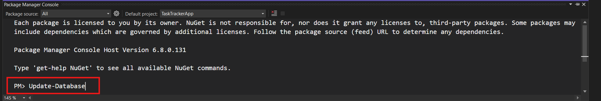

# Tasktracker

Tasktracker is a straightforward task management application built on ASP.NET MVC. It allows users to create, update, and delete tasks efficiently. With a clean and user-friendly interface, managing your tasks becomes a seamless experience.

## Features

- **Create Tasks:** Add new tasks with ease using the intuitive interface.
- **Update Tasks:** Modify task details or mark them as completed as your priorities change.
- **Delete Tasks:** Remove tasks that are no longer relevant or necessary.
- **Detailed View:** Get a comprehensive view of each task, including its name, description, and due date.
- **JQuery and Ajax Integration:** Enhance the user experience with dynamic and responsive features.

## Technologies Used

- **ASP.NET MVC:** The application is built on the robust ASP.NET MVC framework for efficient web development.
- **SQL Server:** The application uses SQL Server as the management system for database operations.
- **JQuery:** Employed JQuery to simplify DOM manipulation and enhance client-side scripting.
- **Ajax:** Integrated Ajax for seamless and dynamic data retrieval, creating a smoother user experience.
- **SweetAlert:** Utilized SweetAlert for user-friendly notifications.

## Getting Started

1.**Open Visual Studio**:

- Open Visual Studio and  choose Clone repository

- Copy this link and paste it and the repository location Field.
https://github.com/alharet7/TaskTrackerApp

- Open the project in Visual Studio.
- Build and run the application.

2.**Set up SQL Server**:

- Ensure you have SQL Server installed and configured.
- Update the connection string in the appsettings.json file with your SQL Server details.
- Update the Database by package Manager Console:

3.**Explore the Tasktracker**:

- Visit the application in your web browser.
- Create, update, and delete tasks to streamline your workflow.

## Notifications

- **SweetAlert** for Deletion: SweetAlert is used to provide user-friendly notifications specifically for task deletion.
When a task is successfully deleted.
In case of errors or failed task deletion operations.
- **Toastr** for Other Actions: Toastr is employed for notifications on other actions.
Successful creation, update, or general notifications.
In case of errors or failed operations.
